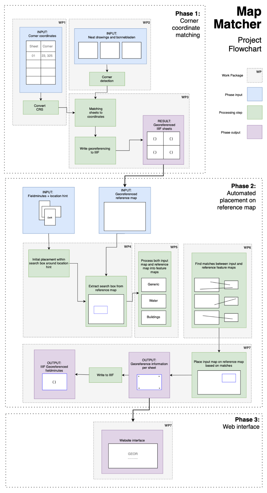

# IIIFMap

By GEOR

- Georgios Iliopoulos
- Eirini C. Tsipa
- Oliver J. Post
- Rianne Aalders

## About the project

This repository and accompanying report is the end result of the project that was carried out as part of
the [TU Delft MSc Geomatics](https://www.tudelft.nl/onderwijs/opleidingen/masters/geomatics/msc-geomatics) Synthesis
Project in cooperation with AllMaps, an open-source platform dedicated to the viewing and georeferencing of historic
maps. The main objective of the project was to automatically georeference historic map series curated and digitised by
the Dutch National Archive. This was based on the corner coordinates of the map sheets. The first issue that had to be
tackled was the reprojection of the original coordinates which were in Bonne projection to WGS84 coordinates. To
determine the corners of the map content within the sheets two methods were implemented. The first one detects the lines
based on HoughLines Probabilistic Transformation and the second one detects lines based on the distribution of black
pixels in the rows and columns of the images. In addition to map sheets with corner coordinates, there are two other
sets of images which were georeferenced utilising a convolution neural network that performs feature matching. The
feature matching was performed by running the two sets of images against the georeferenced sheets with known corner
coordinates. To minimise the search space for this process a geocoder was used to determine the approximate location of
the image. The implemented methods appear to hold the potential for georeferencing old map series. It is worth noting
that the developed algorithms, while effective in many cases, may encounter challenges when dealing with irregularities
on map sheets caused by the passage of time, such as damage. Consequently, there is a great opportunity to further
enhance the algorithms to ensure they can consistently and accurately georeference images, even when faced with such
irregularities. This ongoing development will lead to improved georeferencing accuracy and user confidence.

## Project Structure

The project is split into two phases, phase 1 based on known corner coordinates and phase 2 based on feature matching.
These phases are split into separate sections called “work packages”.

## Code Structure

The aim of the code structure is to split project specific code (very specific to our map series) from general code (
could be used for any map series), in order to make the code reusable for others.

The files are structured in the following way:

- `root`
    - `src` (source code which is generic to any IIIF map series)
    - `project`
        - `phase1` (scripts specific to our map series’ in phase 1)
        - `phase2` (scripts specific to the map matching of the TMK fieldminutes)

### How to use the reusable `src` code

- Central are the MapSheet and MapSeries classes, which allow for reading and writing to/from IIIF georeference
  annotation. The MapSheet class also allows for managing the mask, the goereferencing, and the metadata of the
  annotation as well as retrieving the image and performing a single plot.
- Then, there are the classes in the `mask` module, where specifically the `MaskGenerator` can be used to automatically
  mask a mapsheet. **WARNING** Masks use a different origin for image coordinates than georeferencing.
- The `georeference` module includes several classes and functions for automatically georeferencing a mapsheet based on
  another (already georeferenced) mapsheet or from a georeferenced IIIF map series manifest using an XYZ server.

### How to use the project specific `project` scripts

- The scripts are divided in the different work packages. They usually output in corresponding results folders. Some
  scripts are also dependent on previous results having been generated.
- Some scripts will need you to edit hard coded paths before running.